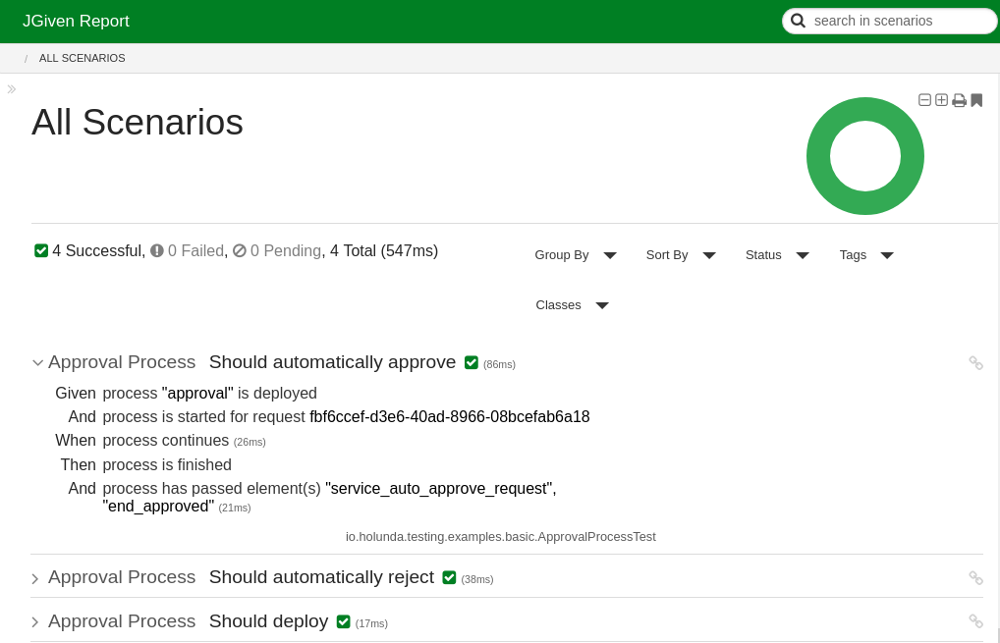

# Camunda BPM JGiven
Camunda specific stages and scenarios for the BDD testing tool JGiven written in Kotlin.

 

## Motivation

Starting from 2012, we are preach that processes are no units. Behavior-driven development (BDD) and the
underlying testing methodology of scenario-based testing is a way more adequate and convenient for writing
process (model) tests. 

Our first attempts addressed testing frameworks Cucumber and JBehave. For JBehave we were even able to release
an official [Camunda BPM extension](https://github.com/camunda/camunda-bpm-jbehave). It turned out that the main problem
in using it, was error-prone writing of the test specifications in Gherkin and glue code in Java.

This is, where [JGiven](http://jgiven.org/) comes on the scene, allowing to write both in Java or any other JVM language
by providing a nice API and later generating reports which are human readable.

## Usage

Add the following dependency to your Maven pom:

    <dependency>
      <groupId>io.holunda.testing</groupId>
      <artifactId>camunda-bpm-jgiven</artifactId>
      <version>0.0.4</version>
      <scope>test</scope>
    </dependency>

## Features

JGiven supports separation of the glue code (application driver) into so-called [stages](http://jgiven.org/userguide/#_stages_and_state_sharing).
Stages contain assert and action methods and may be subclassed. This library provides a base class
`ProcessStage` for building your process testing stages. Here is how the test then looks like
(written in Kotlin):

    @Test
    fun `should automatically approve`() {
    
      val approvalRequestId = UUID.randomUUID().toString()
    
      given()
        .process_is_deployed(ApprovalProcessBean.KEY)
        .and()
        .process_is_started_for_request(approvalRequestId)
        .and()
        .approval_strategy_can_be_applied(Expressions.ApprovalStrategy.AUTOMATIC)
        .and()
        .automatic_approval_returns(Expressions.ApprovalDecision.APPROVE)
    
      whenever()
        .process_continues()
    
      then()
        .process_is_finished()
        .and()
        .process_has_passed(Elements.SERVICE_AUTO_APPROVE, Elements.END_APPROVED)
    
    }

And here is the corresponding stage:

    open class ApprovalProcessActionStage : ProcessStage<ApprovalProcessActionStage, ApprovalProcessBean>() {
    
      @BeforeStage
      open fun `automock all delegates`() {
        CamundaMockito.registerJavaDelegateMock(DETERMINE_APPROVAL_STRATEGY)
        CamundaMockito.registerJavaDelegateMock(AUTOMATICALLY_APPROVE_REQUEST)
        CamundaMockito.registerJavaDelegateMock(ApprovalProcessBean.Expressions.LOAD_APPROVAL_REQUEST)
      }
    
      open fun process_is_started_for_request(approvalRequestId: String): ApprovalProcessActionStage {
        processInstanceSupplier = ApprovalProcessBean(camunda.processEngine)
        processInstanceSupplier.start(approvalRequestId)
        assertThat(processInstanceSupplier.processInstance).isNotNull
        assertThat(processInstanceSupplier.processInstance).isStarted
        return self()
      }
    
      fun approval_strategy_can_be_applied(approvalStrategy: String): ApprovalProcessActionStage {
        getJavaDelegateMock(DETERMINE_APPROVAL_STRATEGY).onExecutionSetVariables(Variables.putValue(APPROVAL_STRATEGY, approvalStrategy))
        return self()
      }
    
      fun automatic_approval_returns(approvalDecision: String): ApprovalProcessActionStage {
        getJavaDelegateMock(AUTOMATICALLY_APPROVE_REQUEST).onExecutionSetVariables(Variables.putValue(APPROVAL_DECISION, approvalDecision))
        return self()
      }
    }
    
The resulting report:

Interested? Check out the examples.

## License

APACHE 2.0

## Contribution

We use gitflow for development. If you want to contribute, start and create
an issue. Then fork the repository, create a feature branch and provide a 
pull-request against `develop`.

If you have permissions to release, make sure all branches are fetched and run: 

     ./mvnw gitflow:release-start gitflow:release-finish
     
from cli. This will update the poms of `develop` and `master` branches.
If you want to publish to central and have sufficient permissions, run

     ./mvnw clean deploy -Prelease
     
on `master` branch. Don't forget to close and release repository on https://oss.sonatype.org/#stagingRepositories.

### Current maintainers

* [Simon Zambrovski](https://github.com/zambrovski)
* [Simon Sprünker](https://github.com/srsp)
* [Jan Galinski](https://github.com/jangalinski)
* [Andre Hegerath](https://github.com/a-hegerath)

