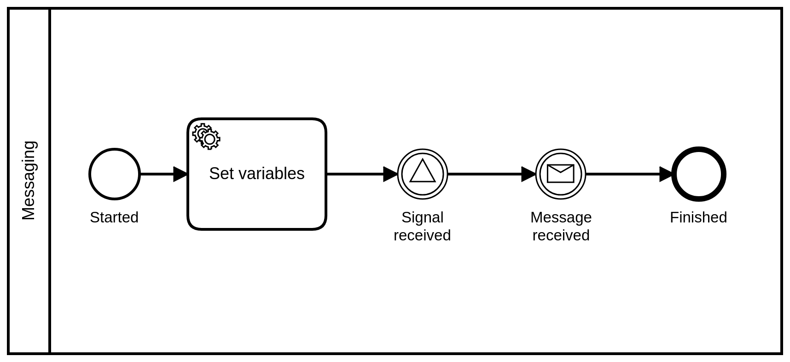

## Working example 

We provide demonstrating the usage of the library, depending on the context.

### Standalone usage

The example demonstrates the usage of the library accessing a process engine via REST from an arbitrary SpringBoot
application. The client executes the following steps:

#### Timing overview of the example

| Initial offset | Repeat | Invoked method         |
| -------------- | ------ | ---------------------- |
|  8.0 sec       | -      | Get deployed processes |
| 10.0 sec       | 5 sec  | Start process          |
| 12.5 sec       | 5 sec  | Send signal            |
| 13.0 sec       | 5 sec  | Correlate message      |


#### How does it work

The application uses the library by adding it to the classpath via Apache Maven dependency. That is:

```xml
<dependency>
  <groupId>org.camunda.community.rest</groupId>
  <artifactId>camunda-platform-7-rest-client-spring-boot-starter</artifactId>
  <version>${project.version}</version>
</dependency>
```

In order to activate the library, the `@EnableCamundaRestClient` has been put
on the configuration class of the application. The interesting part is now the `ProcessClient` component.
This Spring Component has several methods marked with `@Scheduled` annotation to demonstrate
the time-based execution of desired functionality. To do so, the component has two injected resources,
both marked with the `@Qualifier("remote")` annotation. This annotation indicates that the
remote version of the Camunda API services are used.

In order to configure the library, a block of properties e.g. in `application.yml` is required.
The values specify the location of the remote process engine:

```yml
feign:
  client:
    config:
      default:
        url: "http://localhost:8083/engine-rest/"
```

To run this example, you will need the server part from the next example. To activate the server part only, please
run from command line:

```sh
mvn clean install
mvn -f examples/example -Prun
mvn -f examples/example-provided -Prun-server-only
```

### Usage inside a process application

The example demonstrates the usage of the library for accessing a process engine via REST from a Camunda Platform 7 process application.
The key difference to the previous example is that the required Camunda classes are already present on the classpath and
an engine is initialized and is running.

Imagine the process engine has the following process deployed:



The client (running technically in the same JVM, but accessing the engine via REST) again executes the following steps:

#### Timing overview of the example

| Initial offset | Repeat | Invoked method        |
| -------------- | ------ | --------------------- |
|  8.0 sec       | -      | Get deployed processes|
| 10.0 sec       | 5 sec  | Start process         |
| 12.5 sec       | 5 sec  | Send signal           |
| 13.0 sec       | 5 sec  | Correlate message     |

#### How does it work

The application uses the library by adding it to the classpath via Apache Maven dependency. That is:

```xml
<dependency>
  <groupId>org.camunda.community.rest</groupId>
  <artifactId>camunda-platform-7-rest-client-spring-boot-starter-provided</artifactId>
  <version>${project.version}</version>
</dependency>
```

NOTE:   Please note that we use a different starter. The suffix `provided` in the artifact name indicates that the engine
        is already a part of the application and doesn't need to be put on classpath.

In order to activate the library, the `@EnableCamundaRestClient` has been put
on the configuration class of the application. The interesting part is now the `ProcessClient` component.
This Spring Component has several methods marked with `@Scheduled` annotation to demonstrate the time-based execution
of desired functionality. To do so, the component has two injected resources, both marked with the `@Qualifier("remote")`
annotation. This annotation indicates that the remote version of the Camunda API services are used.

In order to configure the library, a block of properties e.g. in `application.yml` is required:

```yml
feign:
  client:
    config:
      default:
        url: "http://localhost:8083/engine-rest/"
```

### Usage of feign clients

The example demonstrates the usage of the library for accessing the REST from a Camunda Platform 7 process application using the generated feign clients.
The difference to the previous examples is that no Camunda dependency is required on the classpath, as the feign clients are used directly.

#### How does it work

The application uses the library by adding it to the classpath via Apache Maven dependency. That is:

```xml
<dependency>
  <groupId>org.camunda.community.rest</groupId>
  <artifactId>camunda-platform-7-rest-client-spring-boot-openapi</artifactId>
  <version>${project.version}</version>
</dependency>
```

In order to activate the library, the `@EnableCamundaFeignClients` has to be put
on the configuration class of the application. The interesting part is now the `ProcessClient` component.
This Spring Component has several methods marked with `@Scheduled` annotation to demonstrate the time-based execution
of desired functionality. To do so, the component has injected the needed feign clients as resources.

In order to configure the library, the same block of properties e.g. in `application.yml` as before is required:

```yml
feign:
  client:
    config:
      ...
```

