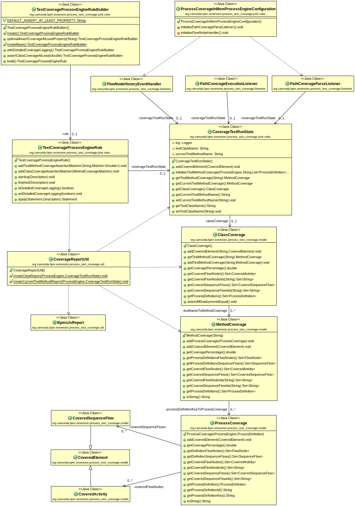

## Implementation Notes

Refer to the UML to get a fast perspective on the coverage rule internals.

### The Story
	
	
- The post BPMN parse listener and execution listener are registered with the process engine configuration.
- Via the post bpmn parse listener we register execution listeners on sequence flows so coverage on these can be recorded.
- Via the history handler/listener we trace execution of flow elements so coverage on these can be recorded.
- Before every test method execution the "starting" method of the rule is executed.
 - The process engine state is initialized.
 - The test run state is initialized if it is the first run for the rule. (The rule is initialized once if a @ClassRule, otherwise a rule including the state is initialized for each test method.) The state is also assigned to the listeners to be able to keep track of covered elements.
 - The process engine is started and process definitions deployed.
 - The deployment is registered with the run state creating a new method coverage.
- The test is executed.
 - During the execution the listeners are adding the covered elements to the coverage state. In turn the coverage state is aggregating the class coverage.
 - The class coverage is a tree. It is aggregated from individual test method coverages. The test method coverages are aggregations of individual process coverages of the deployed process definitions. The process coverages are aggregations of covered elements. By adding a covered element to the class coverage it takes its rightful place in the structure according to the data stored in it and the method by which it has been deployed.
- After the test execution the rule's "finished" method is executed.
 - The test method coverage is retrieved from the state, logged and asserted with against assertions added for the given method (rule.addTestMethodCoverageAssertionMatcher(testName, matcher)). A graphical coverage report is generated for all deployed process definitions.
 - If the rule is a @ClassRule the last run of "finished" logs and asserts the class coverage which is again retrieved from the state. A graphical coverage report is generated for all deployed process definitions.
 - The super class process engine rule handles deployment cleanup. In case of a @ClassRule run process engine cleanup is done.

### Notes

- The bpmns used in the rule unit tests use both the old and new camunda namespaces for easy testing with different camunda versions (new namespaces starting with camunda 7.2.6, 7.3.3, 7.4.0)
- As example use case, in wdw-elab, we set the global minimal coverage property defined in [TestCoverageProcessEngineRuleBuilder.DEFAULT_ASSERT_AT_LEAST_PROPERTY](src/main/java/org/camunda/bpm/extension/process_test_coverage/junit/rules/TestCoverageProcessEngineRuleBuilder.java) as  a build parameter in our jenkins builds to specify the necessary coverage per project.

## UML

 

## Resources
* Use the source, Luke.
* [JavaDoc](https://camunda.github.io/camunda-process-test-coverage/javadoc)
* [Contributing](CONTRIBUTING.md)
* [Readme](README.md)
