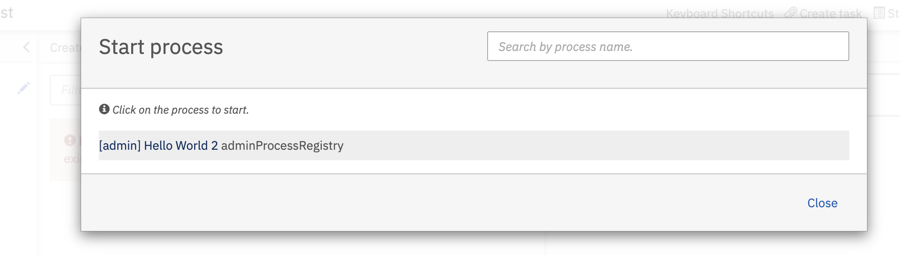
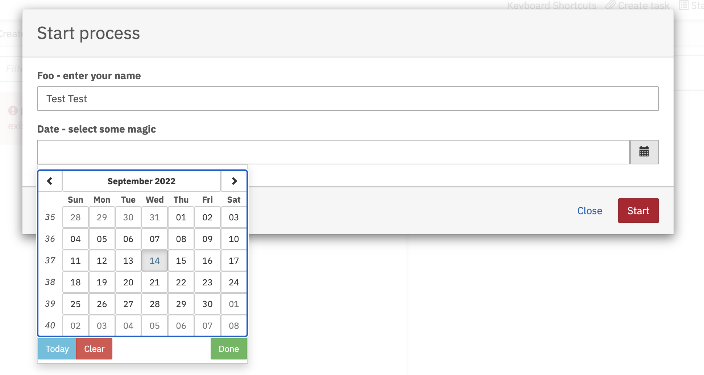

## How does it work

Add the following dependency to your project classpath:

```xml
<dependency>
  <groupId>io.holunda</groupId>
  <artifactId>camunda-admin-process-registry</artifactId>
</dependency>

```
 
Define a Bean Factory for an Admin Process Bean like this:  

```kotlin
  import io.holunda.camunda.platform.adminprocess.AdminProcess


  @Bean
  fun helloWorldAdminProcess(): AdminProcess {
    
    val foo = StringField("foo", "Foo - enter your name")
    val date = DateField("date", "Date - select some magic")

    return adminProcess(
      activityId = "helloWorld",
      label = "Hello World 2",
      formFields = listOf(foo, date)
    ) {
      
      val variables = CamundaBpmData.reader(it)

      logger.info { """ Hi, I am the process running with:
          * foo: ${variables.get(foo)}
          * date: ${variables.get(date)}
        """.trimIndent()
      }
    }
  }
  
```

And you are done! The Spring Boot AutoConfiguration will register the bean 
in the registry, generate the process model and deploy it.

The generated model looks like this:


You can run the process in the webapp: 



And fill out the form:


