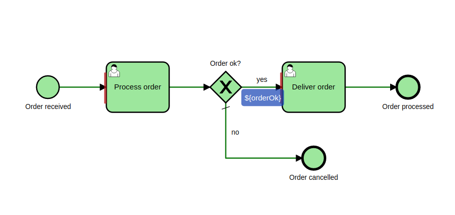

# C7 Process Test Coverage

This Camunda Platform 7 and Platform 8 community extension **visualises** test process **paths** and **checks** your process model **coverage** ratio. Running  typical JUnit tests now leaves **html** files in your build output. Just open one and check yourself what your test did:



## Highlights

* **Visually verify** the paths covered by individual tests **methods** and whole test **classes**
* Visually check gateway **expressions** and transaction borders (**save points**) used by your process
* Calculate and **verify** the nodes (_and_ sequence flow) **coverage** ratio reached by tests methods and classes.

## Just use it

* Integrates with all versions of Camunda Platform 7 starting with 7.20.0 and upwards as well as Camunda Platform 8
* Is continuously checked against the latest Camunda Platform 7 releases (check out our compatibility CI/CD pipeline)
* Tested with JDKs 17 and 21 and different operating systems (Windows, Mac and Linux).
* Supports **JUnit 4.13.1+** (4.11 does not work) or **JUnit 5** for Camunda 7
* Supports **JUnit 5** for Camunda 8 (uses Zeebe Process Test)
* Can be used inside Spring Tests

> [!IMPORTANT]
> If you're running with a Java version prior to 17 you have to use the old version 2.x (latest 2.8.0)

## Documentation

If you are interested in further documentation, please check our [Documentation Page](https://camunda-community-hub.github.io/camunda-process-test-coverage/snapshot/index.html)

## Installation

Add a **Maven test dependency** to your project <a href="https://maven-badges.herokuapp.com/maven-central/org.camunda.community.process_test_coverage/camunda-process-test-coverage-bom"></a>

### JUnit5 (Platform 7)

```xml
<dependency>
  <groupId>org.camunda.community.process_test_coverage</groupId>
  <artifactId>camunda-process-test-coverage-junit5-platform-7</artifactId>
  <!-- <artifactId>camunda-process-test-coverage-junit5-platform-8</artifactId> -->
  <version>${camunda-process-test-coverage.version}</version>
  <scope>test</scope>
</dependency>
```

## Configuration

Use the **ProcessCoverageInMemProcessEngineConfiguration**, e.g. in your `camunda.cfg.xml` (only needed for Platform 7)

```xml
<bean id="processEngineConfiguration"
   class="org.camunda.community.process_test_coverage.engine.platform7.ProcessCoverageInMemProcessEngineConfiguration">
   ...
</bean>
```

Use the **ProcessEngineCoverageExtension** as your process engine JUnit extension (available for Platform 7 and Platform 8)

Either use `@ExtendWith`

Java
```java
@ExtendWith(ProcessEngineCoverageExtension.class)
public class MyProcessTest {}
```

Kotlin
```kotlin
@ExtendWith(ProcessEngineCoverageExtension::class)
class MyProcessTest
```
or `@RegisterExtension`

If you register the extension on a non-static field, no class coverage and therefore no report will be generated. This is due to the fact, that an instance of the extension will be created per test method.

The extension provides a Builder for programmatic creation, which takes either a path to a configuration resource, a process engine configuration or if nothing is passed uses the default configuration resources path (`camunda.cfg.xml`).

The process engine configuration needs to be configured for test coverage. So use **either** the provided `ProcessCoverageInMemProcessEngineConfiguration`, `SpringProcessWithCoverageEngineConfiguration` or initialize the configuration with `ProcessCoverageConfigurator.initializeProcessCoverageExtensions(configuration)`.

If you use Java:
```java
@RegisterExtension
static ProcessEngineCoverageExtension extension = ProcessEngineCoverageExtension
        .builder().assertClassCoverageAtLeast(0.9).build();
```

If you prefer Kotlin:
```kotlin
companion object {
    @JvmField
    @RegisterExtension
    var extension: ProcessEngineCoverageExtension = ProcessEngineCoverageExtension
            .builder(ProcessCoverageInMemProcessEngineConfiguration())
            .assertClassCoverageAtLeast(1.0).build()
}
```

## Quick Start

If you just want to start using the library, please consult our [Getting Started](../../getting-started/c7-process-test-coverage.md) guide.

## User Guide

The user guide consists of several sections.

## Configuration

* [Configure report directory](configuration.md)

## Plugins

* [Sonarqube plugin](sonarqube.md)

## Running the tests

Running your JUnit tests now leaves **html** files for individual test methods as well as whole test classes in your project's `target/process-test-coverage` folder. Just open one, check yourself - and have fun with your process tests! :smile:

