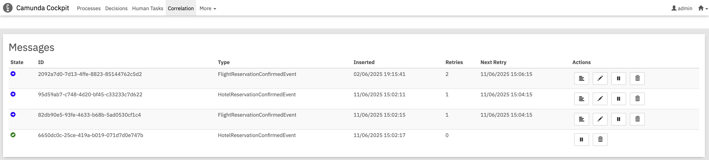
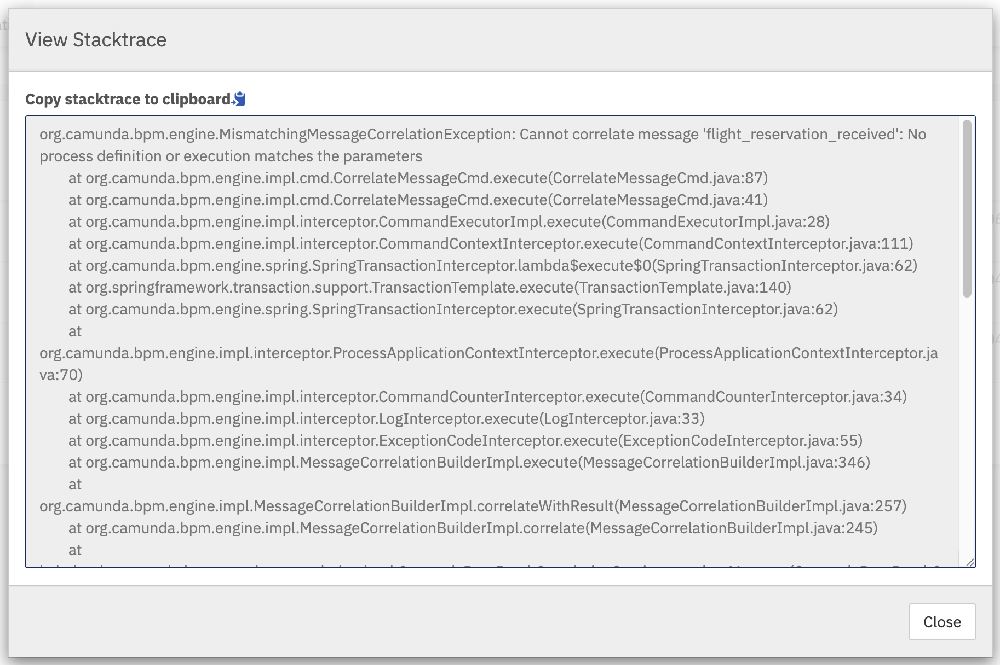
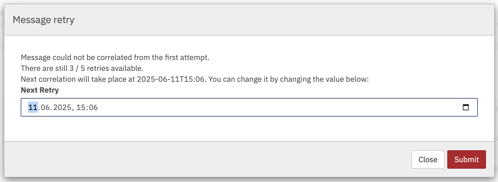

In order to be able to control the process of correlation via inbox storage, we created a cockpit plugin
showing the messages in the system. In order to activate it, just add the following dependency to your 
classpath:

```xml
<dependendcy>
  <groupId>io.holunda</groupId>
  <artifactId>camunda-bpm-correlate-cockpit-plugin</artifactId>
</dependendcy>
```

After restart of the Camunda 7 engine, navigate to the Cockpit WebApp and you will see an additional tab `Correlation`,
showing the message overview.



The table above represents messages stored in the inbox table waiting for the correlation. The columns from left to right are:

  - Message State
  - Message id
  - Payload type
  - Time of ingestion via Ingress
  - Number of retries left
  - Time of next retry attempt
  - Available actions (if available):
    - Show Stacktrace
    - Change retry parameters (next retry, number of retries)
    - Pause / Resume delivery
    - Delete message

If the error is present, you will be able to see the stacktrace in causing the error during correlation:



To change message correlation parameters, click on the corresponding button:




The following message states are available:

 - :glyphicon-ok-sign: green: ok
 - :glyphicon-remove-sign: red: max retries reached
 - :glyphicon-hourglass: orange: paused
 - :glyphicon-circle-arrow-right: blue: retrying
